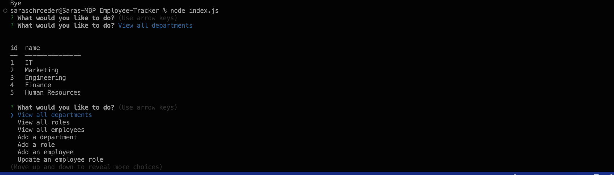

# Employee-Tracker

## Table of Contents
* [Descriptions](#description)
* [Dependencies](#dependencies)
* [Usage](#usage)
* [Credits](#credits)
* [License](#license)
* [Questions](#questions)

## Description

This node-based solution, utilizing inquirer and MySQL, facilitates efficient management of a company's workforce. Through a command-line interface, users can perform various tasks such as adding and viewing departments, roles, and employees, updating employee roles, and deleting departments, roles, and employees. Additionally, the application enables users to view employees according to their managers, thereby streamlining the management process.

## Dependencies

npm install inquirer@8.2.4
npm install mysql2
npm install console.table

## Usage

[Walkthrough](https://drive.google.com/file/d/145i0aBGUsSk00pidNxXb_DmTNjTX45TK/view)

## Credits

[Sara Schroeder](https://github.com/saraschroeder)

## License

[MIT](https://choosealicense.com/licenses/mit/)

## Questions

If you have any questions, please contact me at [sara.schroeder00@gmail.com](mailto:sara.schroeder00@gmail.com). 

Please find my GitHub here!
[saraschroeder](https://github/saraschroeder)